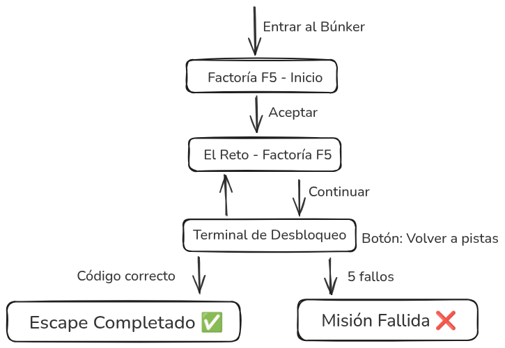

# 🚀 Búnker Factoría F5

Sistema de seguridad oficial de Factoría F5. Escape Room interactivo con estética Cyberpunk Industrial. Supera los retos lógicos para desbloquear la terminal y escapar del búnker.

## 🎨 Identidad Visual
- **Nombre:** Búnker Factoría F5
- **Colores:** Naranja (#FF6B00), Malva, Azul Neón, Fondo Antracita
- **Tipografía:** Saira Stencil (Industrial) + Plus Jakarta Sans (Interface)

## 🗺️ Flujo de Navegación

## 🛠️ Metodología y Herramientas
- **Arquitectura:** Multipage (5 archivos HTML) con navegación `window.location.href`
- **Stack:** HTML5 · CSS3 · Vanilla JS
- **Comunicación:** Discord
- **Gestión de tareas:** GitHub Projects
- **Documentación:** GitHub Wiki
- **Control de versiones:** GitHub con ramas por desarrolladora

## 👥 Equipo

| Desarrolladora | Página | Responsabilidad |
|---|---|---|
| [Paula](https://github.com/paulova0121-alt) | Página 1 | Inicio y lógica de navegación |
| [Cynthia](https://github.com/Zebdon) | Página 2 | El Reto y pistas visuales |
| [Ana Belén](https://github.com/AnaBHernandez) | Página 3 | Terminal, validación y QA |
| [Jessica](https://github.com/rodriguezjessika36-debug) | Páginas 4 y 5 | Pantallas finales y diseño responsive |

---
*Creado por el Equipo de Desarrollo para Factoría F5 - 2026*
